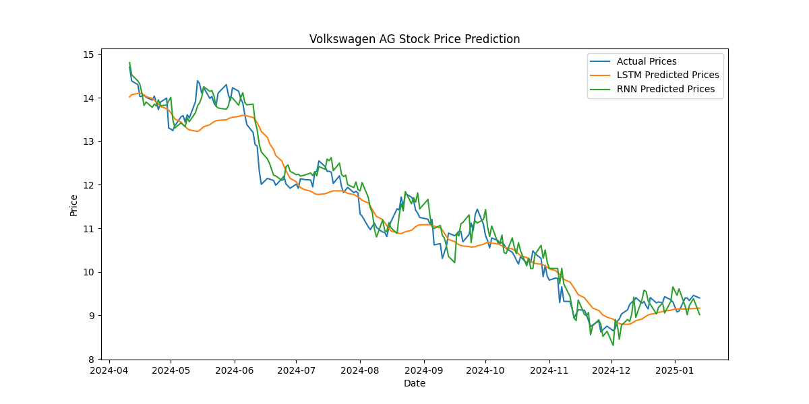
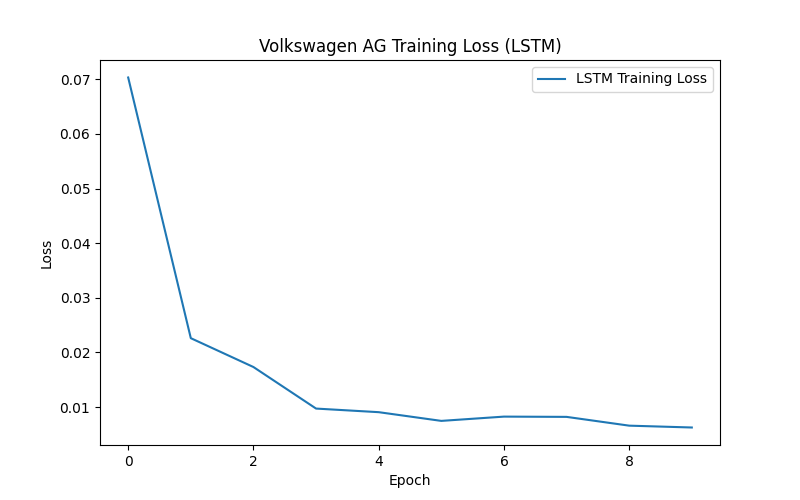
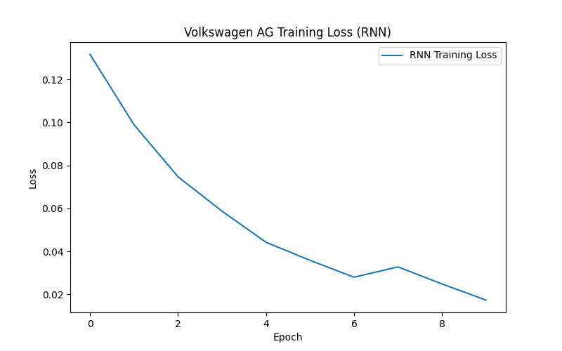

# FinalProjekt

# Ziel

<mark> </mark>

# Installation

* Python version 3.11  
* Tensor flow 2.18
* yfinance
* sklearn
* Qt Plot

<code> pip install tensor flow </code>
<code> pip install yfinance  </code>
<code> pip install sklearn </code>

# Test Scenario

# Problem

# Zusammenfassung