# FinalProjekt

# Ziel

Das Hauptziel dieses Projekts ist es, mithilfe historischer Daten und Modellen (LSTM und RNN) die zukünftigen Aktienkurse von Automobilhersteller zu prognostizieren und die Leistungsfähigkeit dieser Modelle zu vergleichen. Dieser Vergleich hilft Aktienverkäufern und -käufern, fundierte Entscheidungen zu treffen und potenzielle Gewinne zu maximieren.

# Installation

* Python version 3.11  
* Tensor flow 2.18
* yfinance
* sklearn
* Qt Plot

#	Kurzbeschreibung

Das Ziel dieses Experiments ist die Vorhersage der Schlusskurse von Aktien der Automobilherstellers mithilfe eines LSTM-Modells, basierend auf historischen Daten und Merkmalen wie täglichen Kursänderungen.

#	Datenbeschaffung

Mit der yfinance-Bibliothek werden historische, täglich angepasste Aktienkurse von Automobilhersteller heruntergeladen.

#	Zielvariable(Target)

Die Zielvariable ist der Schlusskurs(Close) einer Aktie am folgenden Tag.

#   Inputvariable(Features)

Für jede Aktie wurden folgende Merkmale berechnet: 
1.	Tägliche Kürsänderung(Daily Close-Open): Diefferenz zwischen Schlusskurs und Eröffnungskurs.
2.	Zusätzliche Merkmale: High, Low, Open, Close , Handelsvolume 

#	Modellarchitektur
*   Zwei LSTM-Schichten mit jeweils 50 Neuronen. Die erste Schicht gibt Sequenzen zurück, während die zweite dies nicht tut. 
*	Dropout zur Reduzierung von Overfitting (20%)
*	Zwei Dense, wobei die letzte die Vorhersage des Schlusskurses übernimmt.

#	Hyperparameter
*	Lookback: Verwendung der letzten 60 Tage zur Vorhersage.
*	Optimizer: Adam
*	Loss-Funktion: Mean Squared Error(MSE).

#	Bewertungskriterien: Primäre Metriken
*	Mittlerer Squared Error(MSE): zwischen den tatsächlichen und vorhersagten Schlusskursen.
*	Mittlerer Directional Error (MDE)

#	Baseline
Vergleich der Modellleistung mit einer einfachen Baseline, die den Durchschnitt der letzten 60 Schlusskurse als Vorhersage verwendet. 

# Ergebnis

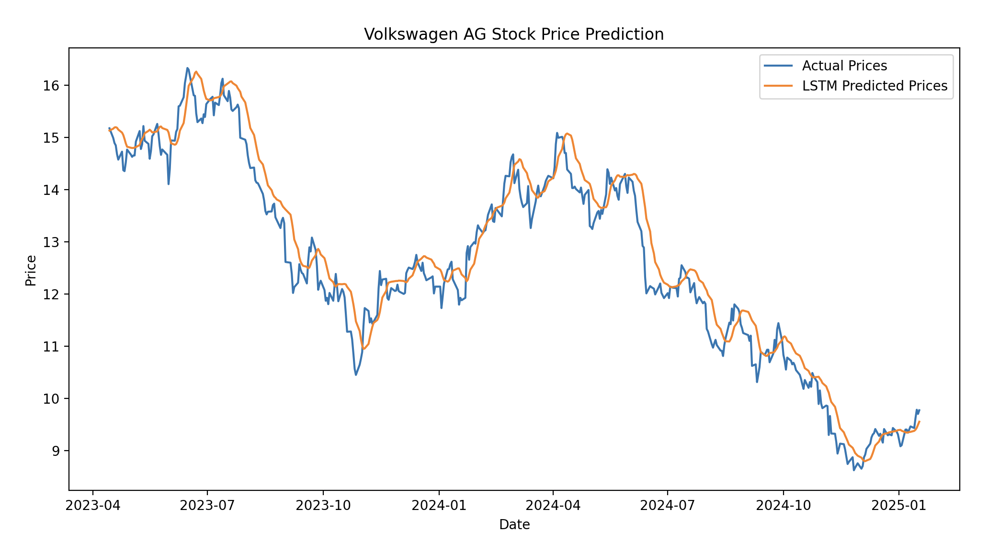
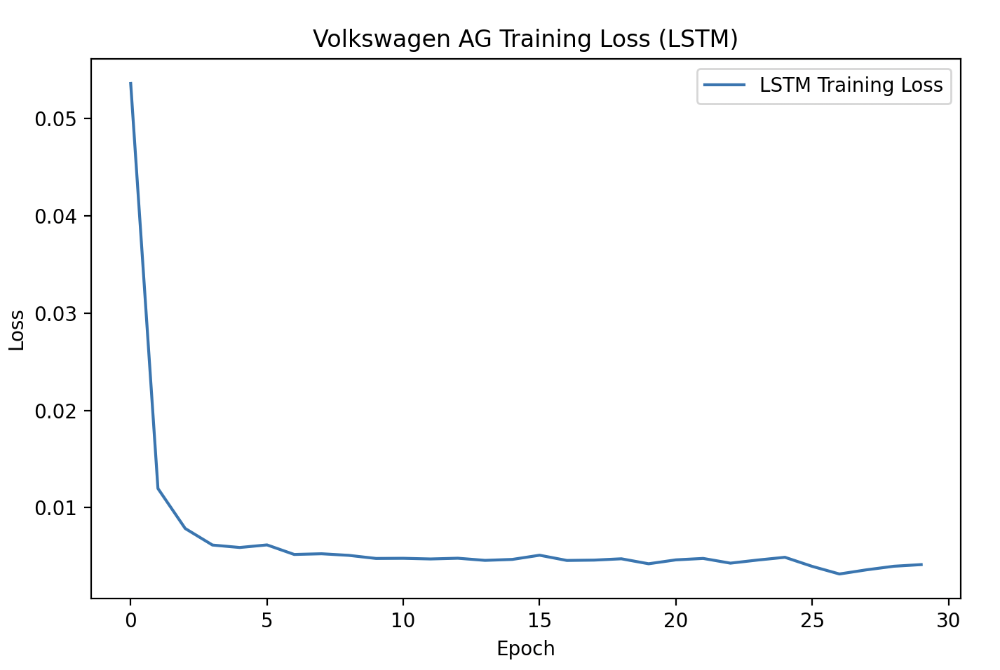
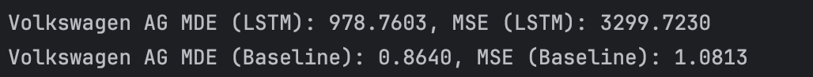

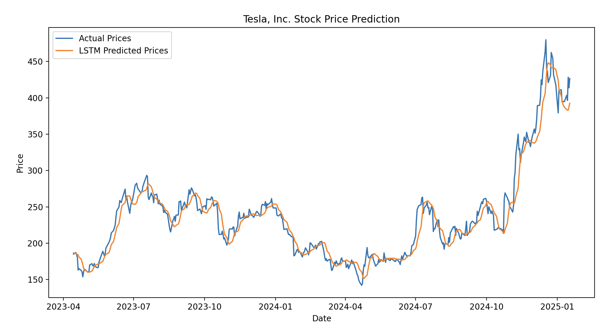
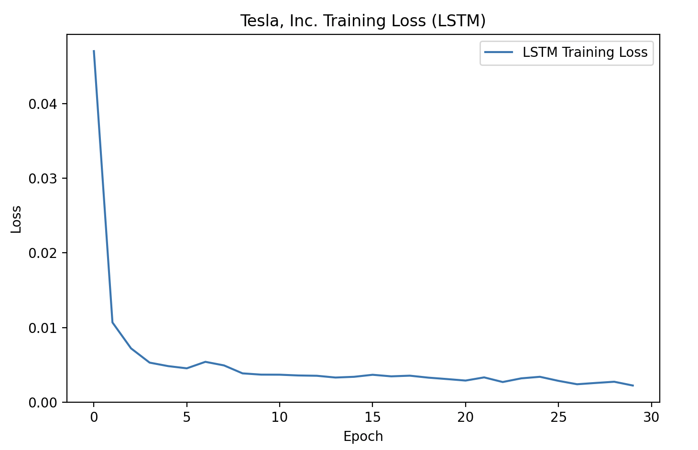
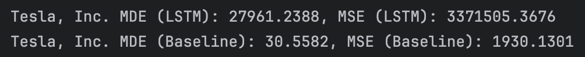

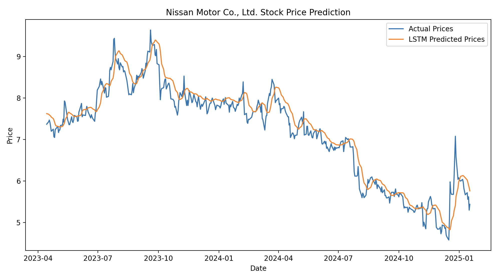
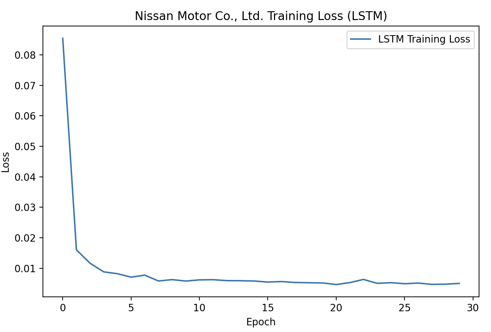
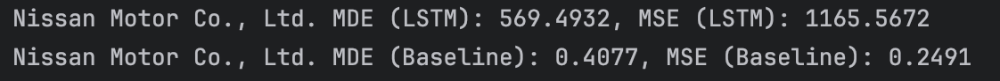

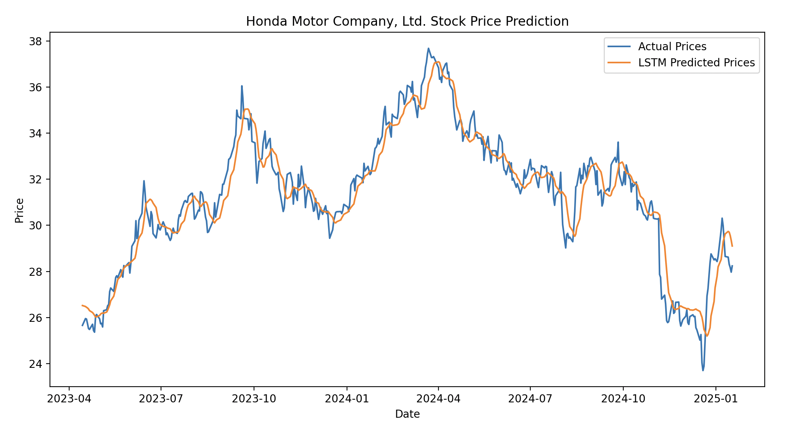
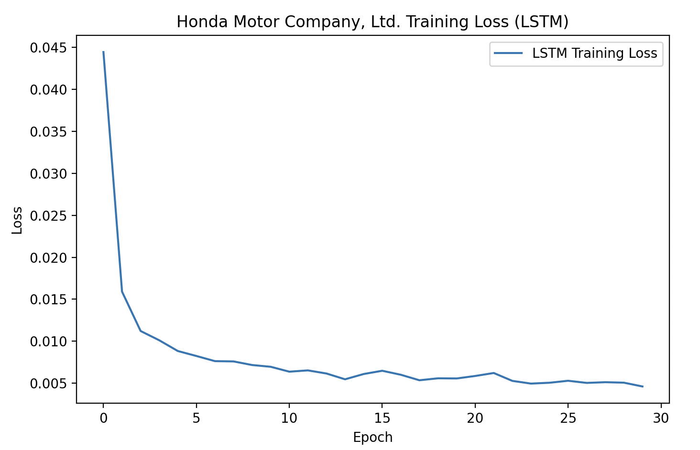
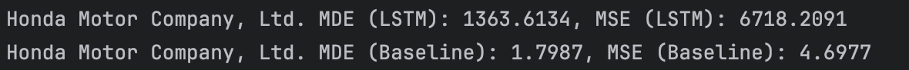

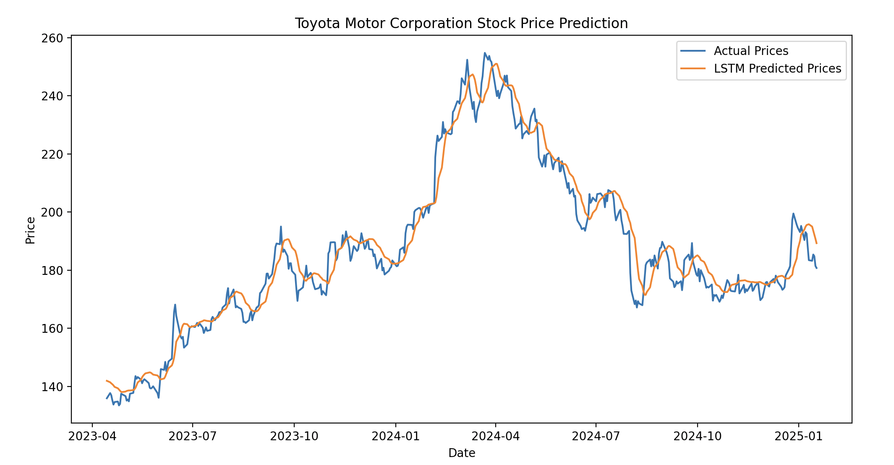
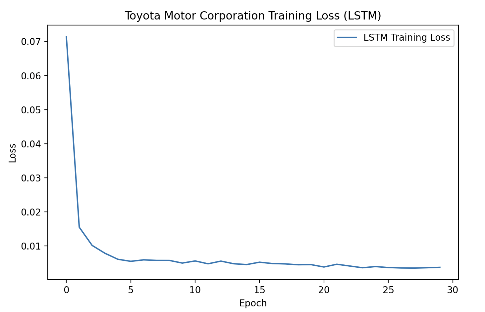
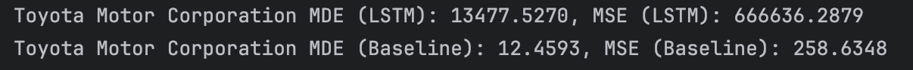

# Problem

Während des Projekts traten verschiedene Herausforderungen auf:

Themenfindung: Es war schwierig, zu Beginn ein passendes Thema zu finden, das sowohl relevant als auch umsetzbar war.

Datenverfügbarkeit: Die Suche nach geeigneten Datenquellen war zeitaufwendig und nicht alle relevanten Daten (z. B. Rohstoffpreise) waren für beide Unternehmen gleichermaßen verfügbar.

Modellauswahl: Die Entscheidung, welche Modelle (z. B. LSTM, ARIMA) verwendet werden sollten, erforderte umfangreiche Recherche und Tests.

Datenqualität: Einige historische Daten waren unvollständig oder enthielten Ausreißer, was eine umfangreiche Vorverarbeitung erforderte.

Zeitaufwand: Die Implementierung und Optimierung von Modellen wie LSTM war zeitintensiv.

# Zusammenfassung

Das Projekt hat gezeigt, dass der Vergleich der Gewinne von Tesla und VW durch eine datengetriebene Analyse möglich ist. Die spezifischen finanziellen Strukturen und Marktbedingungen der beiden Unternehmen wurden berücksichtigt, um eine differenzierte Bewertung zu ermöglichen. Die Nutzung von Zeitreihenmodellen wie LSTM bietet eine vielversprechende Möglichkeit, Vorhersagen zu treffen. Trotz anfänglicher Herausforderungen, wie der Themenfindung, der Suche nach passenden Daten und der Auswahl geeigneter Modelle, konnte ein strukturierter Ansatz entwickelt werden. Dies legt die Grundlage für präzisere Analysen und Vorhersagen in zukünftigen Projekten.
